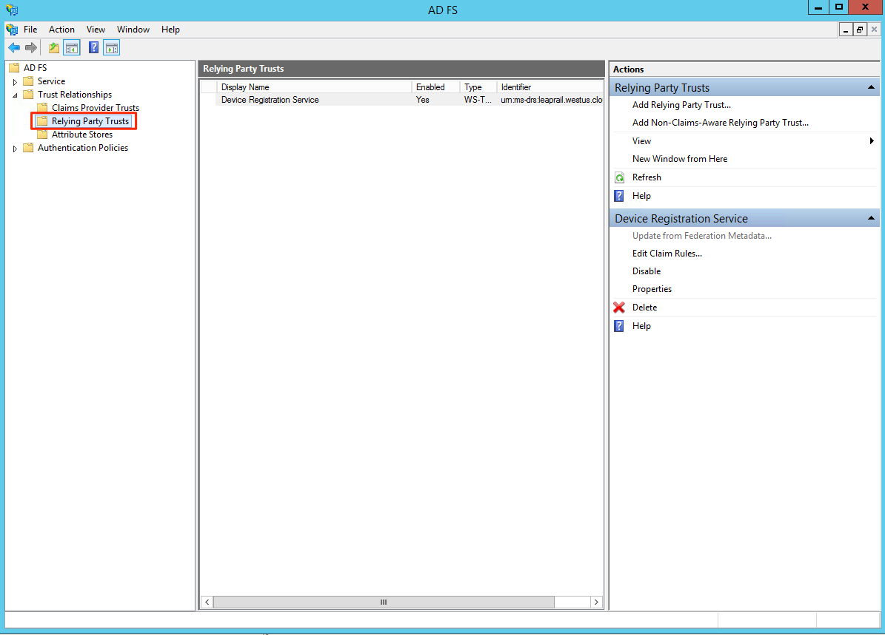
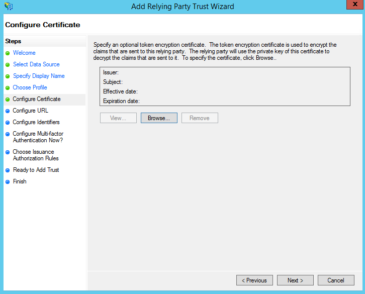

# Configure ADFS Single Sign-On experience

*These instructions were created using Windows Server 2012 R2 and ADFS 3.0*
*Heavily inspired by the [Greenhouse FAQ](https://support.greenhouse.io/hc/en-us/articles/209926626)*

Before you begin configuring ADFS, please send the following information to LeapRail:

* Your Single Sign On URL
* Your [Token-signing certificate](#export-token-signing-certificate)

You will receive the following from LeapRail:

* Your subdomain
* Your OAuth2 client id
* List of Roles and their corresponding Role ids

## Add LeapRail as a Relying Party Trust

1. Navigate to your AD FS Management tool, then open the "Trust Relationships" folder in the left sidebar.
1. Within the "Trust Relationships" folder, open the "Relying Party Trusts" folder.



1. Click "Add Relying Party Trusts" under the "Actions" bar on the right side of the screen. This will open the "Add Relying Party Trust" Wizard.


1. On the Welcome page, click **Start**


1. On the "Select Data Source" page, select "Enter data about the relying party manually" Upload the Metadata file from LeapRail.


1. Enter "Leaprail" as the Display Name, and add any additional notes that you'd like (Use "Leaprail Staging" if this is for integrating with Leap Rail Test environment).


1. Select "AD FS Profile" and continue


1. No need to configure a certificate so continue to next step



1. No need to configure urls so continue to the next step


1. Add `<subdomain>.leaprail.com` as the identifier. You should have received the subdomain to use in this step from LeapRail team (Use `staging-<subdomain>.leaprail.us` if this is for integrating with Leap Rail Test environment).


1. You’ll be given the option to set up Multi-factor authentication. This is isn't necessary for your LeapRail configuration, but feel free to add it if you'd like.


1. Select "Permit all users to access this relying party."


1. The next page will be an overview of your configuration. Please confirm that the identifier attribute were set correctly before moving on.


1. On the next page, make sure that the box is checked next to "Open the Edit Claim Rules dialog for this relying party trust when the wizard closes."


## Create Claim Rules for LeapRail

Closing the "Add Relying Party Trust" Wizard will automatically open the "Edit Claim Rules" Wizard for Leaprail. Here, you'll configure the attributes that AD FS will send to LeapRail.

1. Click **Add Rule**.


1. Select "Send LDAP Attributes as Claims" from the drop-down menu.


1. Name the claim rule "LDAP Email and Full Name" and select the "Active Directory" attribute store. Then, add the following rules:
   * Select "E-Mail-Addresses" in the LDAP Attribute column. Select "E-Mail Address" in the Outgoing Claim Type column.
   * Select "Given-Name" in the LDAP Attribute column. Select "User.FirstName" in the Outgoing Claim Type column.
   * Select "Surname" in the LDAP Attribute column. Select "User.LastName" in the Outgoing Claim Type column.
   * Select "Display-Name" in the LDAP Attribute column. Select "Name" into the Outgoing Claim Type column.
   * Select "Group-Membership" in the LDAP Attribute column. Select "Role" into the Outgoing Claim Type column. This is where AD Groups will be mapped to Leap Rail Role ids. Your Leap Rail rep will provide you with a series of numeric ids. The Role field sent to Leap Rail should be a comma separated list of these ids corresponding to AD groups the user belongs to on your end.


1. You will now see the new rule in your list of claim rules for Leaprail. Click **Add Rule** to add the next rule.


1. Select "Transform an Incoming Claim" from the drop-down menu.


1. Configure the following on the next page:
   * Name the claim rule "Email Transform"
   * Set the **Incoming claim type** to "E-Mail Address"
   * Set the **Outgoing claim type** to "Name ID"
   * Set the **Outgoing name ID format** to "Email"
   * Select "Pass through all claim values"


1. You'll now see both of your new rules in the list of claim rules for Leaprail. 


### Add Roles
Repeat the steps below for each Role that you got from the Leap Rail team. 

1. Select "Send Group Membership as Claim" from the drop-down menu.


1. Configure the following on the next page:
   * Name the claim rule "Role X" where X is the name of the Role you got from the Leap Rail team.
   * Set the **User's Group** to the AD group that corresponds to the Role you got from the Leap Rail team.
   * Set the **Outgoing Claim Type** to "Role"
   * Set the **Outgoing claim value** to the Role id you got from the Leap Rail team.
   


1. You'll now see all of your new rules in the list of claim rules for Leaprail. Click **Apply** and **OK** to close the Wizard.


## Set up the OAuth2 client

1. Make sure OAuth endpoint in ADFS is enabled. Navigate to your AD FS Management tool, then open the "Service" folder in the left sidebar.


1. Within the "Service" folder, open the "Endpoints" folder and make sure that `/adfs/oauth2` endpoint is enabled.


1. Open your Powershell in ADFS.
1. Run the following command in Powershell. Make sure to replace the `UUID` with the value you have received from LeapRail team for the `ClientId`.
```
Add-ADFSClient -Name "Leaprail" -ClientId "<UUID of the client>" -RedirectUri "https://apps.leaprail.com/login/sso" -Description "OAuth 2.0 client for Leap Rail" 
```
If this is integrating with Leap Rail Test environment use the following instead
```
Add-ADFSClient -Name "Leaprail Staging" -ClientId "<UUID of the client>" -RedirectUri "https://staging-apps.leaprail.us/login/sso" -Description "OAuth 2.0 client for Leap Rail Staging" 
```


## Set the NotBeforeSkew Parameter

When a user logs in through ADFS, the OAuth2 Response to LeapRail will contain "NotBefore" and "NotOnOrAfter" attributes that designate the timeframe during which the Response is valid. However, the ADFS server clock and the LeapRail server clock may become out of sync so that the timestamp of the OAuth Response sets to a time earlier than the one established in the "NotBefore" attribute. In this case, the Response will not be valid and the user will not be able to log in.

To ensure that your users aren’t affected by server synchronization issues, please set a skew of at least two minutes on the "NotBefore" attribute by following the instructions below:

1. Open your Powershell in ADFS.
2. Check the current NotBeforeSkew by running the following command in the Powershell:
```
Get-ADFSRelyingPartyTrust –identifier "<subdomain>.leaprail.com"
```
   * Your subdomain will match the Relying Party Identifier which was configured in Part One, Step 10. Typically, this is the name of your organization.
If this is integrating with Leap Rail Test environment use the following instead
```
Get-ADFSRelyingPartyTrust –identifier "staging-<subdomain>.leaprail.us"
```
3. In the Powershell response, scroll to the attribute "NotBeforeSkew." The number next to the "NotBeforeSkew" will be the current time skew of that attribute in minutes.


4. Next, set the "NotBeforeSkew" to be 2 minutes by running the following command in the Powershell:
```
Set-ADFSRelyingPartyTrust –TargetIdentifier "<subdomain>.leaprail.com" –NotBeforeSkew 2
```
If this is integrating with Leap Rail Test environment use the following instead
```
Set-ADFSRelyingPartyTrust –TargetIdentifier "staging-<subdomain>.leaprail.us" –NotBeforeSkew 2
```

5. Check the new "NotBeforeSkew" by running the following command again:
```
Get-ADFSRelyingPartyTrust –identifier "<subdomain>.leaprail.com"
```
   * The NotBeforeSkew should now be set to “2”.

## Export Token-signing certificate

Token signing certificates are standard X509 certificates that are used to securely sign all tokens that the federation server issues. LeapRail needs the
public key for this certificate to verify tokens we receive are actually issued by your federation servers.

Follow these steps to export this certificate in Base-64 encoded format.

1. Navigate to your AD FS Management tool, then open the "Service" folder in the left sidebar. Within the "Service" folder, open the "Certificates" folder.


1. Find the Token signing certificate and double-click on it.


1. Click on **Details** tab


1. Click on **Copy to File**


1. On the Export Wizard, click **Next**


1. Select "Base-64 encoded X.509" format


1. Select the file location and name


1. Verify the settings and click **Finish**


1. Send the exported file to LeapRail team
1. Make sure you update the LeapRail team whenever [this certificate is updated](https://technet.microsoft.com/en-us/library/dn781426.aspx).
