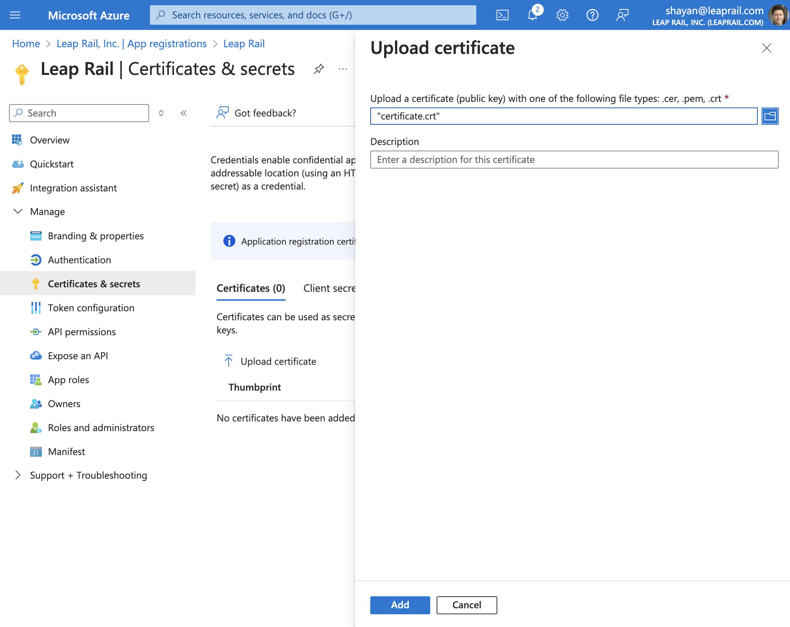
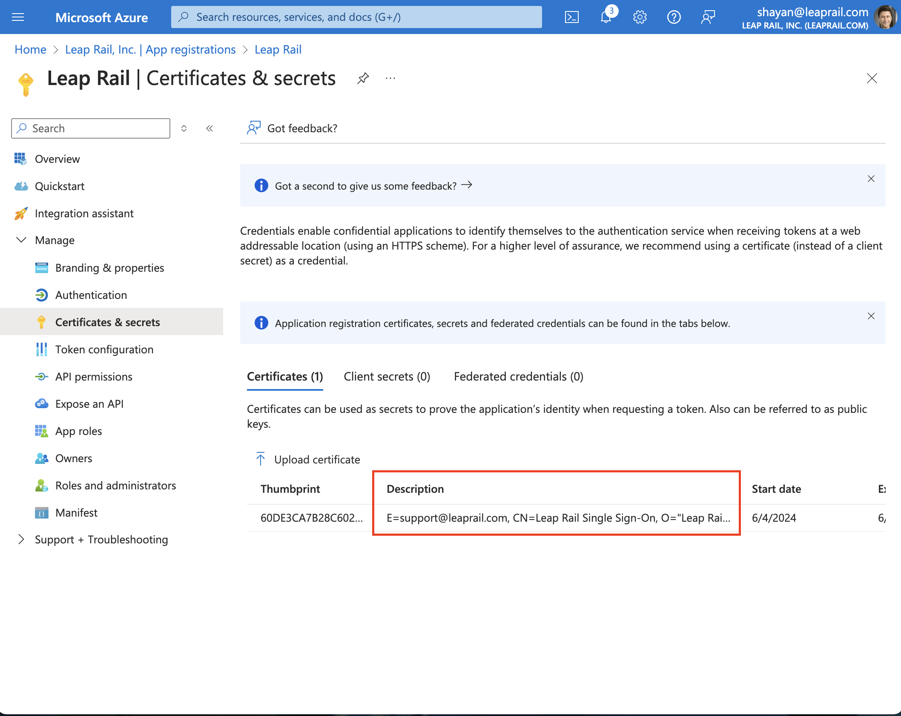

# Configure Microsoft Entra ID (Azure AD) Single Sign-On experience

Please follow the instructions below to set up Leap Rail on your MS365 as an oauth application.

You will receive the following from LeapRail for this process:

* Your subdomain
* A Leap Rail Single Sign-On certificate
* List of Roles and their corresponding Role ids

## Register the Leap Rail application

1. Navigate to your Azure Portal
1. Search for "Intra ID" in the top search box.

1. Click on "Manage" and "App registrations"" on the left menue. 

1. Click **New registration**
1. On the "Register an application" page, Add "Leap Rail" as a single tenant application.

1. Click "Register" and save the Application/Client ID and Diretory/Tenant ID. Send this info to your Leap Rail contact. 

1. Click on "Manage" and then "Certificates & Secrets" on the left menu. On the tabs in the middle of the screen, click on "Certificates".

1. Click on "Upload certificate" and select the "Leap Rail Single Sign-On certificate" you received from the Leap Rail team.

1. Verify that the certificate description is for Leap Rail.

1. Next, click on "Token configuration" and "Add optional claim" link.

1. On the "Add optional claim" select "ID" as token type and select "email", "family_name", and "given_name" as "Claim".

1. Click "Add" and on the dialog, select "Turn on the Microsoft Graph email, profile permission".

1. Next, click on "App roles"

1. For every role that you received from the Leap Rail team, you will repeat the steps of clicking the "Create app role" link.

1. After you add all the roles, you should have a screen that looks like this:

## Give users permission to Leap Rail

1. On the top search box, search for "Enterperise applications"

1. Select the Leap Rail application.

1. Click on "Manage" and the "Users and groups"
1. In order to give a user/group permission to one of the Leap Rail roles, click on the "Add user/group" link.

1. Select the user and then the appropriate role.

1. You will now see the user being assigned to the role.

1. In order to give a user multiple roles, repeat this process as many times as necessary.

1. Users given access to the Leap Rail roles can navigate to https://apps.leaprail.com/login/sso and login by typing in the "domain" value that the Leap Rail team assigned to your organization in the beginning of this process.

1. Remember to send the client ID and tenant ID to the Leap Rail team so they can complete the process on their end.
