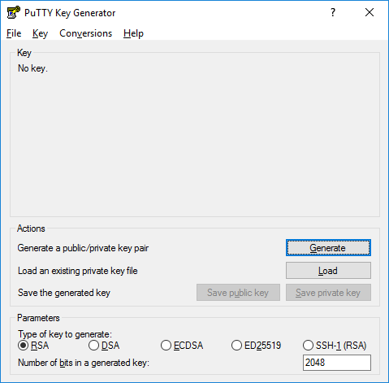
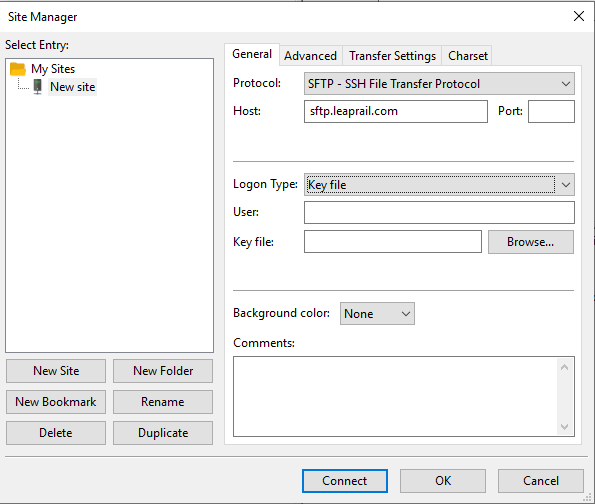

# Configure SFTP client

Leap Rail SFTP server relies on a SSH Key based authentication for communicating with SFTP clients. This guide will walk you through the steps required to establish this connectivity.

## Generate a SSH public/private key pair

PuTTYgen is an key generator tool for creating [SSH keys](https://www.ssh.com/ssh/key/) for PuTTY. It is analogous to the ssh-keygen tool used in some other SSH implementations.

> Note: This step DOES NOT need to performed on the server ultimately used for communicating with Leap Rail and can be done on any windows machine following these instructions.

### Installing PuTTYgen 

PuTTYgen is normally installed as part of the normal PuTTY `.msi` package installation. There is no need for a separate PuTTYgen download. [Download the PuTTY installation package](https://www.ssh.com/ssh/putty/download).

### Running PuTTYgen 

Go to Windows **Start menu → All Programs → PuTTY → PuTTYgen**.

To create a new key pair, select the type of key to generate from the bottom of the screen: RSA with 2048 bit key size is good for most people.

Then click **Generate**, and start moving the mouse within the Window. Putty uses mouse movements to collect randomness. The exact way you are going to move your mouse cannot be predicted by an external attacker. You may need to move the mouse for some time, depending on the size of your key. As you move it, the green progress bar should advance.

Once the progress bar becomes full, the actual key generation computation takes place. This may take from several seconds to several minutes. When complete, the public key should appear in the Window. We will not provide a passphrase for the key as this key will be used in automation.

Once the key pair is generated, save both the privacy key and public key by clicking on the appropriate buttons.

Now, you should **transfer the private key file to a secure location** on the server(s) used for automating data transfer to Leap Rail.

The public key file should be sent to your Leap Rail contact in order to issue the necessary credentials for your connection.

At the end of this process, your Leap Rail contact will send back a `username` that you will use in conjunction with the private key created here for establishing connectivity.

## SFTP Connection

In this example, we are using Windows FileZilla client for connecting to Leap Rail SFTP servers. However, any other client should be usable in a similar manner.

Go to FileZilla **File → Site Manager**.

For `Protocol` select the `SFTP - SSH File Transfer Protocol` value.

For `Host`, type in `sftp.leaprail.com`.

For `Logon Type`, select `Key file` option.

You should have received a `User` value from Leap Rail at the end of previous section.

For `Key file`, browse to where you stored the private key we created as part of previous section.

Now you should be able to connect to Leap Rail SFTP server.
